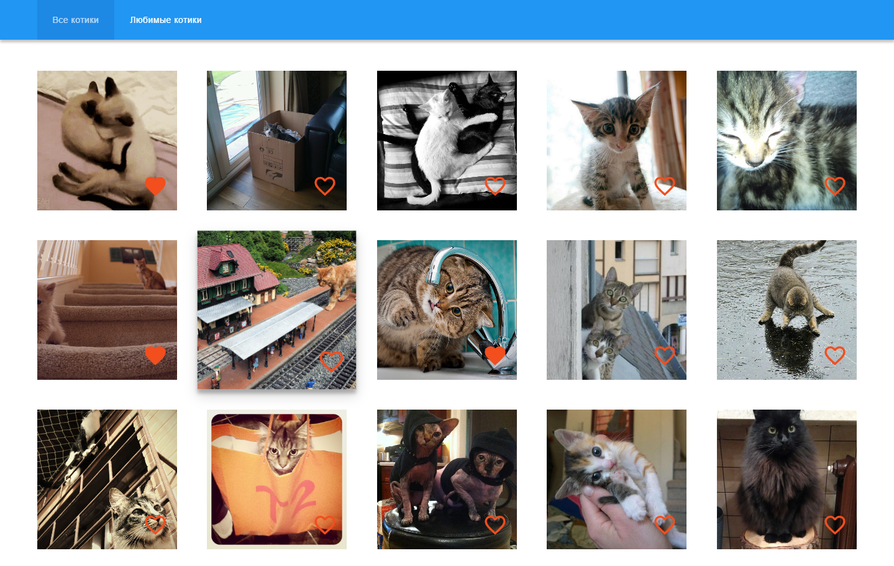
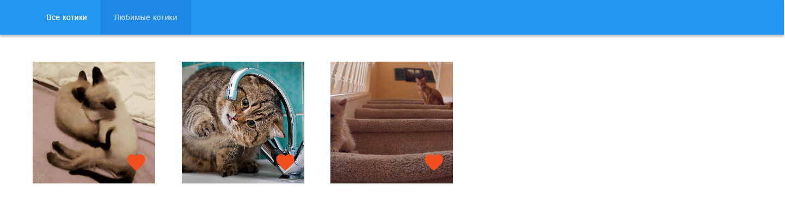
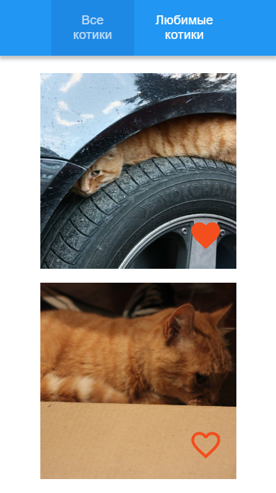
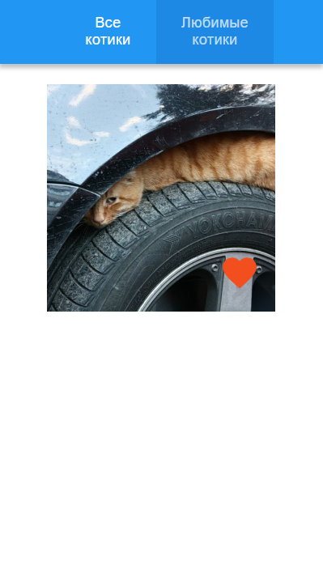

# Задание для Front-end стажёра

## Проект "Кошачий пинтерест" 🐱

[Демо на GitHub Pages](https://helenvirtanen.github.io/frontend-challenge/)

Интерфейс для просмотра котиков с помощью API https://thecatapi.com  
Дизайн - https://bit.ly/3utxaL2  

## Сделано
✅ По умолчанию открывается вкладка "все котики"  
✅ У котика есть возможность добавить в "любимые" и убрать из "любимых" (клик по сердечку)  
✅ Данные о "любимых" котиках хранятся на клиенте (localStorage)  
✅ На вкладке "любимые котики" отображаются добавленные в "любимые" котики  
✅ Адаптивность  
✅ Бесконечная прокрутка  

## 🛠️ Стек
- React
- TypeScript
- Vite

## 🌳 Структура проекта 
src/  
├── api/          # API-запросы (fetchCats)  
├── components/   # React-компоненты  
├── hooks/        # Кастомные хуки (useFavourites)  
├── pages/        # Страницы  
└── assets/       # Иконки и стили  

## 🖼️ Скриншоты
### 🏠 Главная страница "Все котики"
 

### ❤️ Страница "Любимые котики"


### Мобильная версия
| Все котики | Любимые котики |
|---------|------------------|
|  |  |


## 🚀 Установка и запуск
1. Клонируйте репозиторий:
git clone https://github.com/HelenVirtanen/frontend-challenge
2. Установите зависимости:
``` 
npm i
```

3. Получите API-ключ:
- Зарегистрируйтесь на https://thecatapi.com 
- Создайте файл .env в корне проекта
- Добавьте в него переменную VITE_CAT_API_KEY=<ваш ключ без кавычек>

4. Запустите приложение:
```
npm run dev
```
   
Приложение будет доступно по адресу http://localhost:5173
